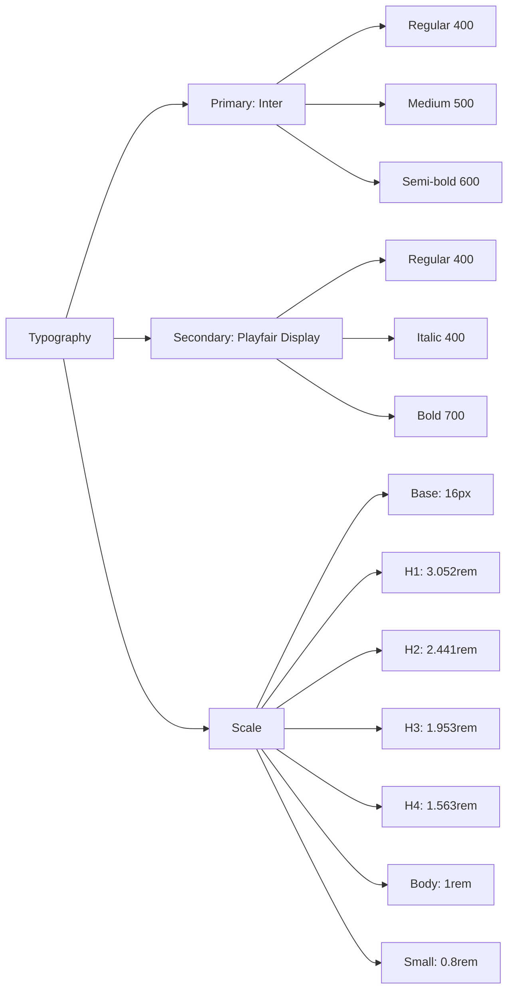
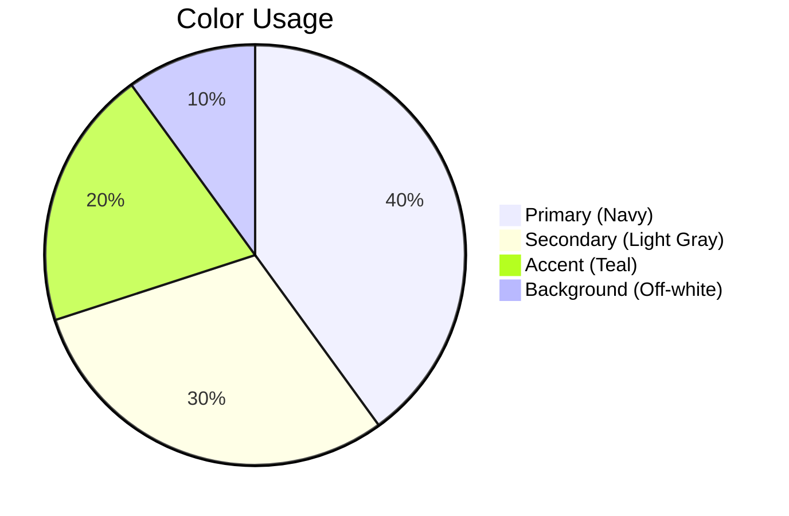
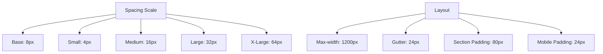
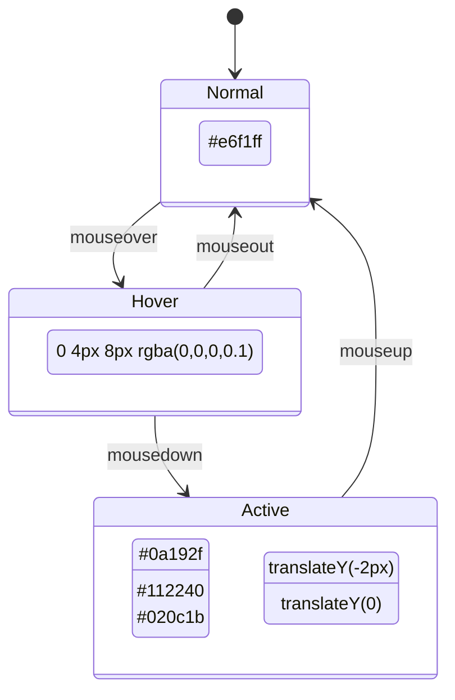
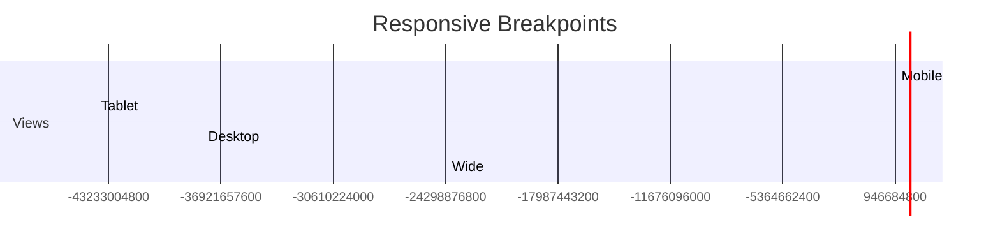
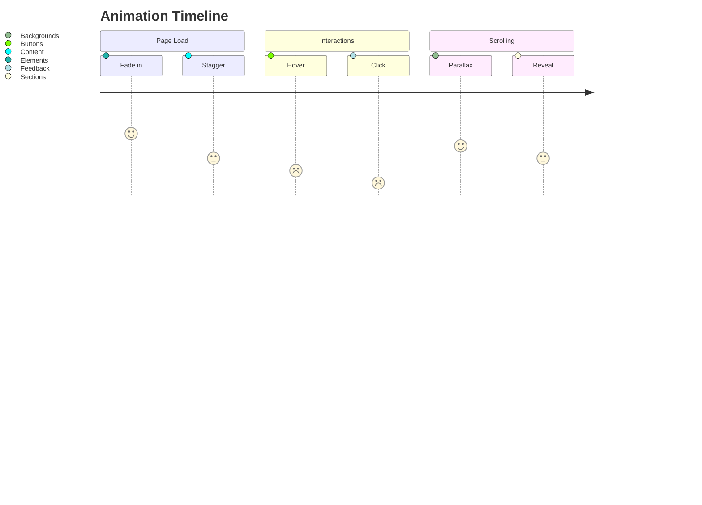

# Portfolio Style Guide

## Typography System



## Color Palette



- **Primary**: `#0a192f` (Deep Navy)
- **Secondary**: `#e6f1ff` (Light Gray)
- **Accent**: `#64ffda` (Soft Teal)
- **Background**: `#f8f8f8` (Off-white)

## Spacing & Layout



## Interactive Elements



## Image Treatment

- **Project Thumbnails**:
  - Aspect ratio: 16:9
  - Border radius: 8px
  - Shadow: 0 4px 6px rgba(0,0,0,0.1)
  - Hover effect: scale(1.02) with shadow elevation

- **Modal Images**:
  - Max-height: 60vh
  - Maintain aspect ratio
  - Lazy loading
  - Optional: subtle zoom on hover

## Breakpoints



## Animation Principles



## Implementation Notes

1. **Font Loading**:
   ```html
   <link href="https://fonts.googleapis.com/css2?family=Inter:wght@400;500;600&family=Playfair+Display:ital,wght@0,400;0,700;1,400&display=swap" rel="stylesheet">
   ```

2. **CSS Variables**:
   ```css
   :root {
     --primary: #0a192f;
     --secondary: #e6f1ff;
     --accent: #64ffda;
     --bg: #f8f8f8;
     --spacing-base: 8px;
     --max-width: 1200px;
   }
   ```

3. **Transition Defaults**:
   ```css
   * {
     transition: all 0.3s ease-out;
   }