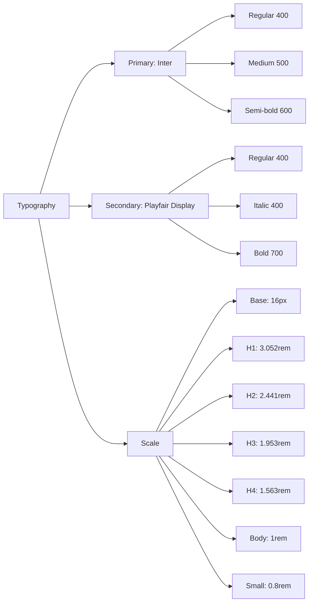
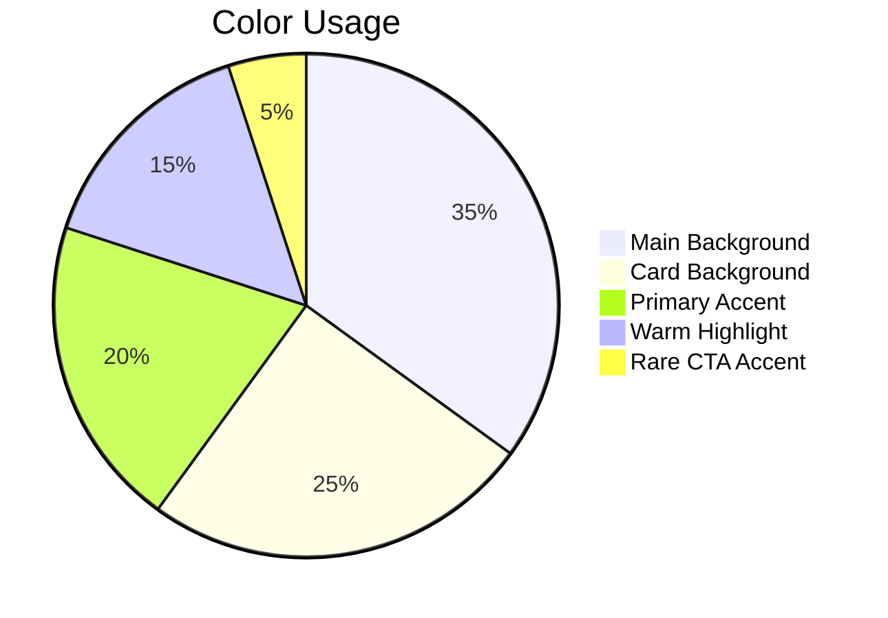
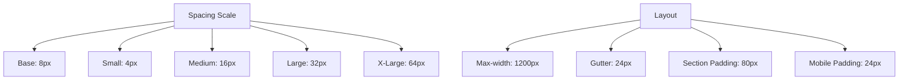
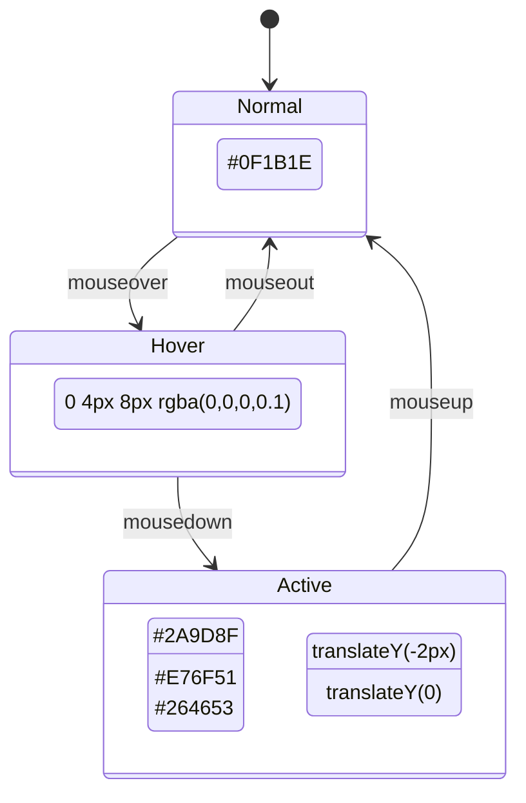
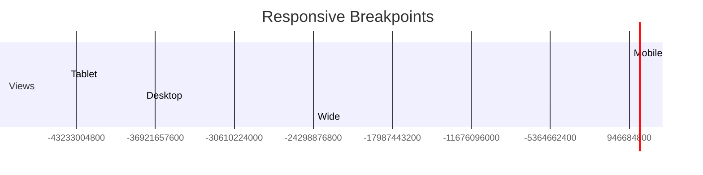
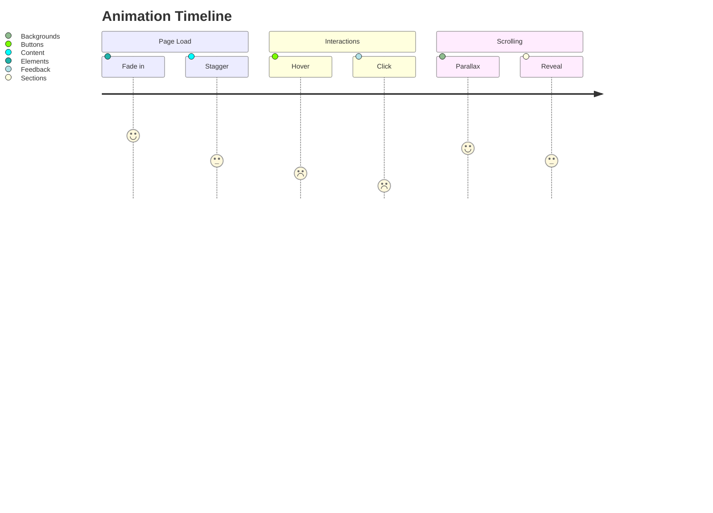

# Portfolio Style Guide

## Typography System


```mermaid
graph LR
    A[Typography] --> B[Primary: Inter]
    A --> C[Secondary: Playfair Display]
    A --> D[Scale]
    
    B --> B1[Regular 400]
    B --> B2[Medium 500]
    B --> B3[Semi-bold 600]
    
    C --> C1[Regular 400]
    C --> C2[Italic 400]
    C --> C3[Bold 700]
    
    D --> D1[Base: 16px]
    D --> D2[H1: 3.052rem]
    D --> D3[H2: 2.441rem]
    D --> D4[H3: 1.953rem]
    D --> D5[H4: 1.563rem]
    D --> D6[Body: 1rem]
    D --> D7[Small: 0.8rem]
```

## Color Palette


```mermaid
pie
    title Color Usage
    "Main Background" : 35
    "Card Background" : 25
    "Primary Accent" : 20
    "Warm Highlight" : 15
    "Rare CTA Accent" : 5
```

- **Main Background**: `#0F1B1E` or `#111827`
- **Card / Section Background**: `#172A2E` or `#1F2937`
- **Main Text**: `#F8FAFC`
- **Secondary Text**: `#CBD5E1`
- **Primary Accent**: `#2A9D8F`
- **Warm Highlight**: `#E9C46A`
- **Rare CTA / Hover Accent**: `#E76F51`

## Spacing & Layout


```mermaid
graph TD
    S[Spacing Scale] --> S1[Base: 8px]
    S --> S2[Small: 4px]
    S --> S3[Medium: 16px]
    S --> S4[Large: 32px]
    S --> S5[X-Large: 64px]
    
    L[Layout] --> L1[Max-width: 1200px]
    L --> L2[Gutter: 24px]
    L --> L3[Section Padding: 80px]
    L --> L4[Mobile Padding: 24px]
```

## Interactive Elements


```mermaid
stateDiagram-v2
    [*] --> Normal
    Normal --> Hover: mouseover
    Hover --> Active: mousedown
    Active --> Normal: mouseup
    Hover --> Normal: mouseout
    
    state Normal {
        fill: #2A9D8F
        text: #0F1B1E
    }
    
    state Hover {
        fill: #E76F51
        transform: translateY(-2px)
        shadow: 0 4px 8px rgba(0,0,0,0.1)
    }
    
    state Active {
        fill: #264653
        transform: translateY(0)
    }
```

## Image Treatment

- **Product Thumbnails**:
  - Aspect ratio: 16:9
  - Format: WebP
  - Include the Portfolio Item or Artifact title as readable, high-contrast text
  - Use a concise category or artifact-type label when it improves recognition
  - Pair the text with a work-relevant visual motif, document interface, diagram, or product mockup
  - Prefer the established dark navy/deep-teal background, subtle dotted grid, bold white type, and controlled mint/coral/yellow accent bands
  - Do not use generic generated art, decorative mockups, or abstract illustrations without identifying text
  - Do not place invented scores, percentages, names, findings, outcomes, or other evidence-like values inside illustrative interfaces
  - Preserve safe margins so the title and key visual remain legible in responsive crops
  - Border radius: 8px
  - Shadow: 0 4px 6px rgba(0,0,0,0.1)
  - Hover effect: scale(1.02) with shadow elevation

- **Evidence Photograph Exception**:
  - Authentic workshop, facilitation, event, participant-activity, photoshoot, or group photography may remain unaltered
  - Do not replace an authentic Evidence Photograph merely because it has no overlaid text
  - Do not classify generated, staged, or stock-photo-style imagery as an Evidence Photograph
  - Use accurate alt text that identifies the activity or context without making unsupported claims

- **Modal Images**:
  - Max-height: 60vh
  - Maintain aspect ratio
  - Lazy loading
  - Optional: subtle zoom on hover

## Breakpoints


```mermaid
gantt
    title Responsive Breakpoints
    dateFormat  px
    axisFormat %s
    
    section Views
    Mobile : 0, 576
    Tablet : 576, 768
    Desktop : 768, 1200
    Wide : 1200, 9999
```

## Animation Principles


```mermaid
journey
    title Animation Timeline
    section Page Load
      Fade in: 5: Elements
      Stagger: 3: Content
    section Interactions
      Hover: 2: Buttons
      Click: 1: Feedback
    section Scrolling
      Parallax: 4: Backgrounds
      Reveal: 3: Sections
```

## Implementation Notes

1. **Font Loading**:
   ```html
   <link href="https://fonts.googleapis.com/css2?family=Inter:wght@400;500;600&family=Playfair+Display:ital,wght@0,400;0,700;1,400&display=swap" rel="stylesheet">
   ```

2. **CSS Variables**:
   ```css
   :root {
     --primary: #F8FAFC;
     --secondary: #CBD5E1;
     --accent: #2A9D8F;
     --accent-hover: #E76F51;
     --highlight: #E9C46A;
     --bg: #0F1B1E;
     --card-bg: #172A2E;
     --spacing-base: 8px;
     --max-width: 1200px;
   }
   ```

3. **Transition Defaults**:
   ```css
   * {
     transition: all 0.3s ease-out;
   }
